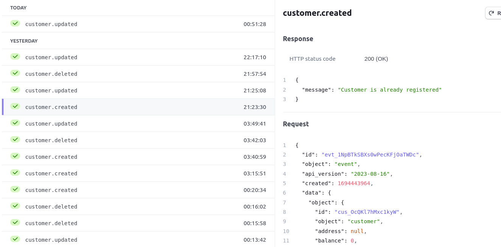

# Two-Way Integrations

This project demonstrates the implementation of a two-way integration system that synchronizes a local customer catalog with an external service, specifically Stripe, in near real-time. The integration is designed to be extendable for future integrations with other catalogs and systems within the product.

## Running it locally

- Clone the respository using HTTPS or SSH method.
- Create a virtual environment. Use [this link](https://docs.python.org/3/library/venv.html#creating-virtual-environments) as reference.
- Activate the environment according to the OS you are currenlty using.
- Install all the dependencies needed to run this project using `pip install -r requirements.txt`
- Create a stripe test account and paste the API_KEY provided to you in **.env** file with key  '*STRIPE_API_KEY*' by creating it in parent directory.
- Now open 3 terminals in the parent directory of this project:
    1. To run the main.py file using the command `uvicorn main:app --reload`
    2. To run the server.py to store the messages in queue using `python server.py`
    3. To expose our local server to the Stripe or Internet using `ngrok http 8000` as 8000 is the PORT we are using to run our main.py
- The 3rd terminal provides us a random URL similar to `https://1b81-117-219-22-193.ngrok-free.app` which we need to add in Stripe as webhook hosted endpoint. Make sure that you add `/stripe-webhook` at the end of URL so that it becomes a correct endpoint.
- Wohoo, You are all set to play with this project now. 

## Requirements 

Before getting started, I made these prerequisites as given in the [assignment](https://zenskar.notion.site/Zenskar-Assignment-Back-End-Engineer-Intern-c2b28fa7ed0247008197c09d10ff8532) :

1. **Database**: Created a simple customer table in an SQL-based relational database (using SQLite) with columns (ID, name, email).

2. **Stripe Account**: Set up a free test account on Stripe and added the API_KEY to `.env` file to secure my stripe accout.

3. **Queueing System**: I am using ZeroMQ as queueing system.

## Implementation

### Outward Sync (Local to Stripe):

- Changes to customer entries in the product are being made via an API.
- Any changes should be added to the queue for processing.
- Created a worker that listens to the queue and updates corresponding customer data in Stripe.

### Inward Sync (Stripe to Local):

Webhook (I chose Option 2):
- Set up an API server on my local machine.
- Exposed this server as a webhook to Stripe using Ngrok.
- Stripe will send events to this webhook for changes in its customer catalog.
- Processed these events to sync my product's customer catalog.
- I have also added many edge cases to check if the user created is already present, or if the user is already deleted when deleting, etc.

### Extending for Future Integrations

To extend this integration for additional systems like Salesforce's customer catalog:

- My code is well-structured and modular, with separate components for each integration. So, we can easily understand the code and make the necessary changes to the codebase.

## Conclusion

This project showcases a flexible two-way integration system that synchronizes a local customer catalog with external services like Stripe. With a well-structured and modular codebase, it is easy to extend this system to support additional integrations and other systems within the product.

Feel free to reach out if you have any questions or need further assistance.
